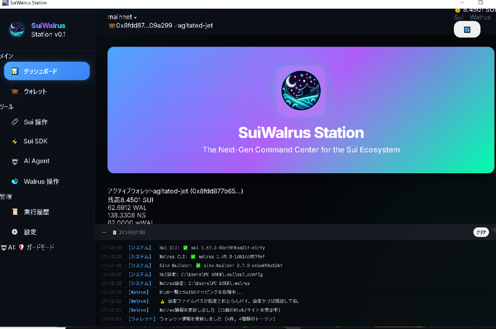
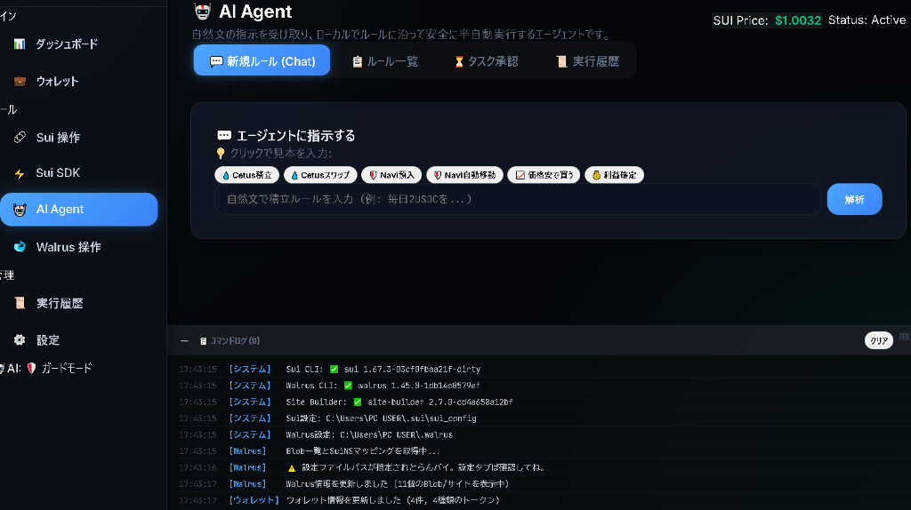
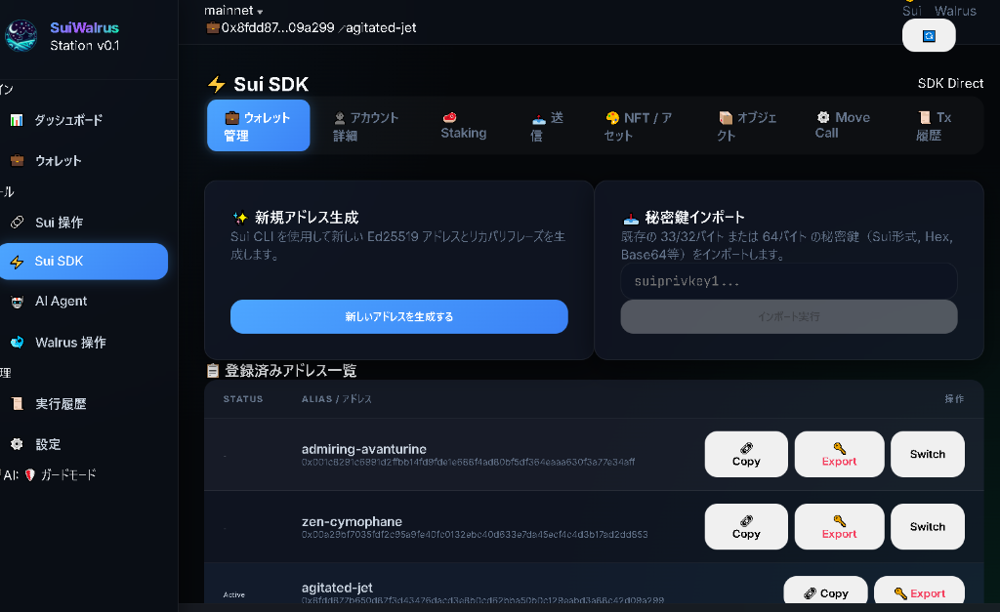
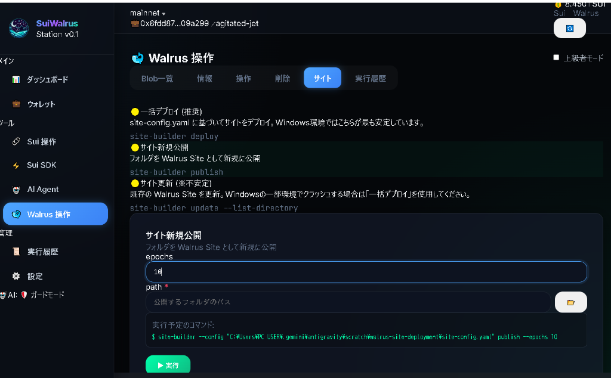
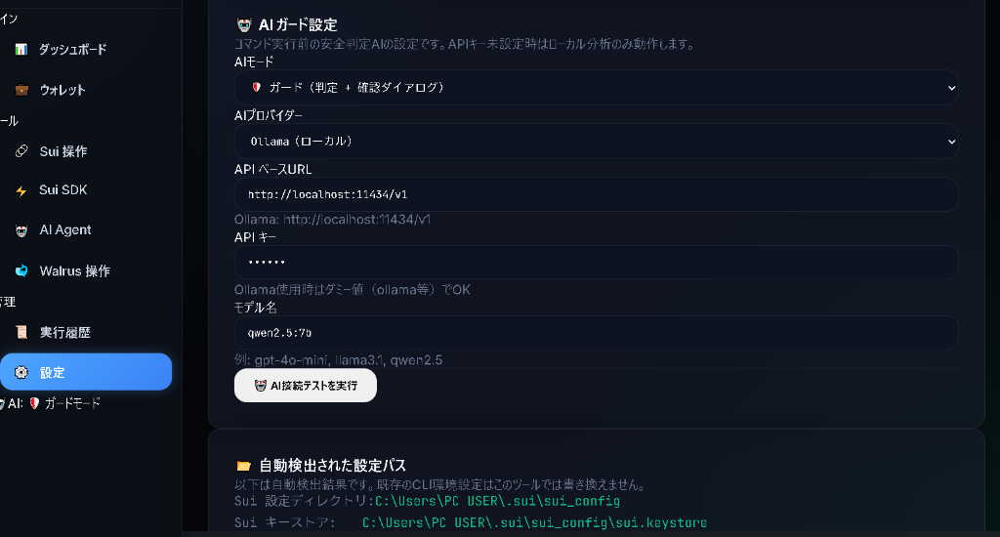

<div align="center">
  
  
  # SuiWalrus Station 🚀
  ### The All-in-One AI-Powered Command Center for Sui & Walrus
  **SuiエコシステムをAIと共に自在に操る、次世代オールインワン・コマンドセンター**

  [](LICENSE)
  [](https://sui.io)
  [](https://tauri.app)
  [](https://react.dev)
  [](#service-fee)

  [**Explore Features**](#features) • [**Quick Start**](#quick-start) • [**Security**](#security-first) • [**Community**](#community)
</div>

---

## 🌊 What is SuiWalrus Station?
**SuiWalrus Station** is a secure, local-first desktop application designed to be the ultimate companion for the Sui blockchain and Walrus storage. It bridges the gap between complex CLI operations and end-users through an intuitive, **AI-driven intent interface**.

**SuiWalrus Station** は、SuiブロックチェーンとWalrusストレージを安全にラップし、全ての操作を直感的な **AIインテント・インターフェース** で統合した、ローカル完結型のデスクトップ・ダッシュボードです。

---

## 🎨 Product Showcase
<div align="center">
  
  <br>
  <em>The Next-Gen Command Center: Real-time asset tracking and system status at a glance.</em>
</div>

---

## ✨ Features

### 1. 🤖 AI-Powered Autopilot (AIエージェント)


Control your DeFi strategies through a conversational interface.
- **Natural Language Parsing**: "Swap 2 USDC to SUI every day at 9 AM" — just say it, and it's done.
- **Strategy CRUD**: Create, Update, Delete, and Toggle rules with ease.
- **Protocol Integration**: Native support for **Cetus** (Swap) and **Navi Protocol** (Supply).
- **Price Triggers**: Automated trades based on **Pyth Network** oracle thresholds.
- **Smart Scheduler**: Background automation with manual approval support for ultimate safety.

### 2. 💎 Ultimate Sui Wallet Dashboard (ウォレット・ダッシュボード)


Beyond a simple wallet, it's a command center for your on-chain identity.
- **Asset Management**: Real-time balance for SUI and all custom tokens.
- **Coin Operations**: Native Merge/Split functionality to optimize your object structures.
- **Stake & Unstake**: Real-time Validator APY monitoring and one-click staking.
- **NFT Gallery**: Preview rich NFT media (IPFS-ready) and manage transfers securely.
- **Key Management**: Full BIP32/BIP39 support for creation, import, and address rotation.

### 3. 🐋 Walrus & Site Builder (分散型ストレージ連携)


Manage your decentralized footprint on the Walrus network.
- **Blob Explorer**: Browse and monitor your data blobs on Walrus.
- **Site Deployment**: Track site-builder deployments and SuiNS domain integrations.

---

## 🔐 Security First


We believe your keys are your own. 鍵の主権は常にユーザーにあります。

- **Direct Keystore Access**: We use your existing `~/.sui/sui.keystore`. 
- **Zero Cloud**: We never upload or transmit your private keys or mnemonic phrases.
- **AI Safety Test**: Integrated connection testing for local LLMs (Ollama) with configurable timeouts (up to 30 min).
- **Local Signing**: All transaction signatures happen locally on your computer via the CLI wrapper.

---

## 💰 Service Fee Model
To sustain development while ensuring user safety, we employ a success-based fee model.
開発の継続と安全性の維持のため、成功報酬型の手数料モデルを採用しています。

- **Mainnet Automation**: A **3% service fee** is applied only to automated/scheduled executions on Mainnet.
- **Atomic Execution**: Fees and transactions are bundled into a single **PTB**. If the main action fails, **no fee is charged**.
- **Testnet/Manual is FREE**: Using Testnet/Devnet or manual CLI operations incurs **0% fee**.

---

## 🏁 Quick Start

### For Beginners (初心者の方向け導入手順)
1. **Prerequisites**:
   - [Node.js (v18+)](https://nodejs.org/)
   - [Rust & Tauri Essentials](https://tauri.app/v1/guides/getting-started/prerequisites)
   - [Sui CLI](https://docs.sui.io/guides/developer/getting-started/sui-install)
2. **Setup**:
   ```bash
   git clone https://github.com/Aynyan2828/SuiWalrus-Station.git
   cd suiwalrus-station
   npm install
   cp .env.example .env
   # Edit .env with your Sui/Walrus CLI paths
   ```
3. **Launch**:
   ```bash
   npm run tauri dev
   ```

---

## 🛠 Tech Stack
- **Engine**: Tauri v2 (Rust)
- **Frontend**: React 18, Vite, TypeScript
- **State Management**: React Context + Reducer (Optimized Local Sync)
- **On-chain**: @mysten/sui SDK, Cetus Aggregator, Navi SDK
- **Connectivity**: Local CLI process spawning (Secure environment)

---

## 📅 Roadmap
- [ ] **Advanced Yield Optimizer**: Auto-compounding strategy for Navi/Cetus rewards.
- [ ] **Portfolio Visualization**: Rich charts for historical asset growth.
- [ ] **PWA Support**: Mobile companion interface for remote monitoring via secure tunnel.
- [ ] **Multi-DEX Aggregation**: Integrating Aftermath and Turbos for better routes.

---

## 🤝 Community & Support
- **Star us on GitHub** to show your support! ⭐
- **Open an issue** for bugs or feature requests.

---

## 💌 Maker's Message (魂のメッセージ)
ばりばりに進化した SuiWalrus Station、どうかな？🚀
Suiのエコシステムばもっと身近に、もっと面白くしたかと思って魂込めて作っとるばい。
世界中の人がこれば使って「Suiって最高やん！」って思ってくれたら、開発者冥利に尽きるっちゃん。🔥

ばりばりフィードバックば待っとるけん、一緒に未来ば創っていこうばい！バリバリ！

---
© 2026 CryptoArk. Built for the Sui community with 💙.
